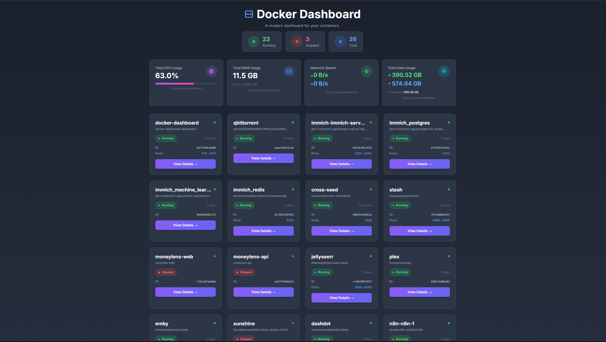
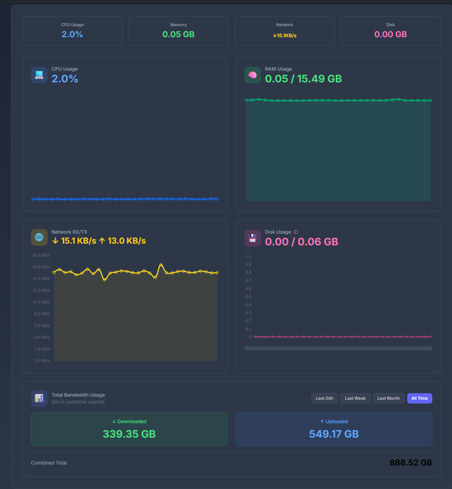
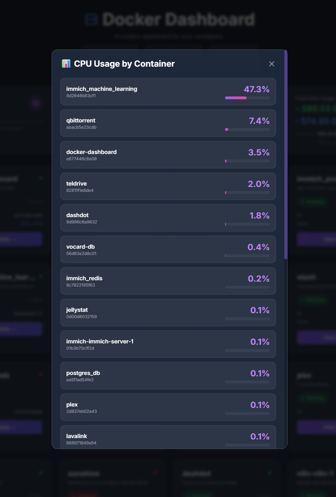
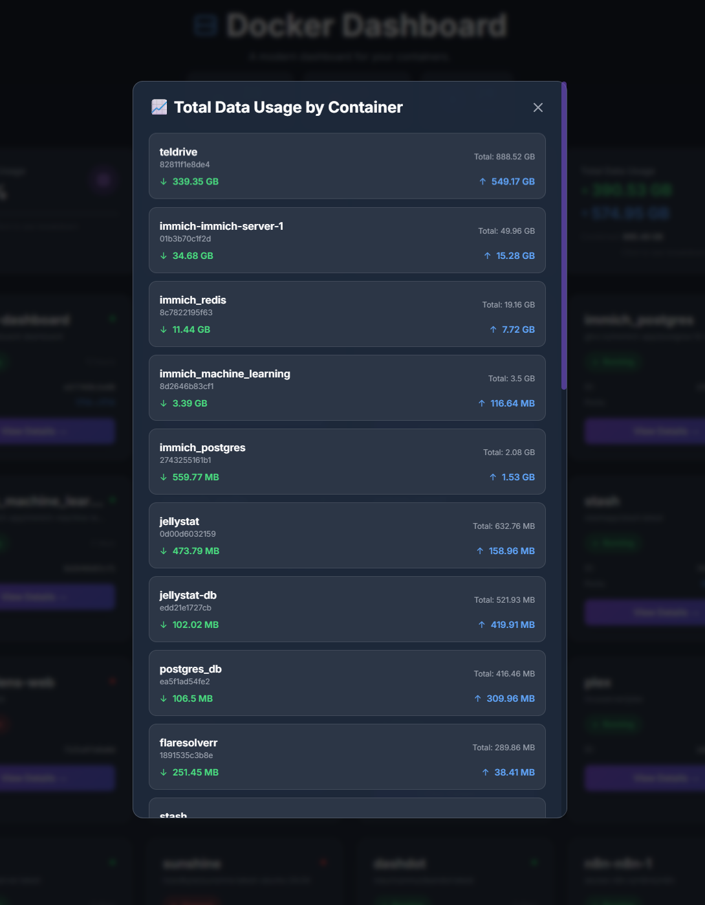

<div align="center">
  <h1>🚢 Docker Dashboard</h1>
  <p>A fully containerized web app to monitor, manage, and view live stats/logs for all your Docker containers.<br>
  <b>100% Docker-based | No local dependencies | Linux optimized</b></p>
  <p>
    
    
    
    
  </p>
</div>

---

## ✨ Features

* 📊 **Live Monitoring:** Real-time CPU, RAM, Network, and Disk usage with interactive charts
* 📡 **Bandwidth Tracking:** Monitor total data downloaded/uploaded by each container
* 🔗 **qBittorrent Integration:** Accurate bandwidth tracking for VPN-bound qBittorrent containers
* ⏱️ **Time Range Controls:** View bandwidth stats for Last 24h, Week, Month, or All Time
* 📝 **Log Streaming:** View live container logs with WebSocket streaming
* 🎛️ **Container Management:** Start, stop, and restart containers with one click
* 🎨 **Modern UI:** Ultra-modern glass-morphism design with animated gradients
* 🔐 **Authentication:** Optional login system with bcrypt password hashing
* 🐳 **Portainer Integration:** Use Portainer as a gateway for multi-host support
* 📦 **Fully Containerized:** No Node.js, npm, or any local dependencies required
* 🐧 **Linux Optimized:** Designed and tested for Linux servers

---

## 📸 Screenshots

<div align="center">

### Dashboard Overview

*Monitor all your containers at a glance with real-time stats*

### Container Details & Live Charts

*Detailed metrics with interactive charts and live updates*

### CPU Usage Breakdown

*See which containers are using the most CPU*

### Data Usage Analytics

*Track download and upload for each container*

</div>

---

## 🚀 Quick Start (Docker Only)

```bash
# Clone the repository
git clone https://github.com/MNDL-27/docker-dashboard.git
cd docker-dashboard

# Copy the example compose file
cp docker-compose.example.yml docker-compose.yml

# Start with Docker Compose
docker compose up -d

# Or use the helper script
chmod +x start.sh
./start.sh
```

**Access Dashboard:** Open [http://localhost:1714](http://localhost:1714)

> **⚠️ Prerequisites:** Docker and Docker Compose must be installed on your Linux system.  
> No other dependencies required!

**📖 Detailed guide:** See **[Quick Start Wiki](wiki/Quick-Start.md)**

### 🔧 Making Changes to Code

Your code is mounted as a volume, so you can edit and restart without rebuilding:

```bash
# 1. Edit any file in server/ or public/
# 2. Restart to see changes
docker compose restart

# No rebuild needed! 🎉
```

**📖 Development guide:** See **[DEVELOPMENT.md](DEVELOPMENT.md)** for full details

---

## 📚 Documentation

### 📖 **[Visit the Wiki →](wiki/Home.md)**

Our comprehensive wiki includes:

- **[Quick Start Guide](wiki/Quick-Start.md)** - Get running in 5 minutes
- **[Configuration](wiki/Configuration.md)** - Environment variables and settings
- **[API Reference](wiki/API-Reference.md)** - REST and WebSocket endpoints
- **[Troubleshooting](wiki/Troubleshooting.md)** - Common issues and solutions
- **[Summary](wiki/Summary.md)** - Complete wiki overview

---

## 🐳 Deployment

### Method 1: Docker Compose (Recommended)

```bash
docker compose up -d
```

### Method 2: Docker CLI

```bash
docker build -t docker-dashboard .
docker run -d \
  --name docker-dashboard \
  -p 1714:1714 \
  -v /var/run/docker.sock:/var/run/docker.sock:ro \
  --restart unless-stopped \
  docker-dashboard
```

### Method 3: Helper Script

```bash
chmod +x start.sh
./start.sh
```

**📖 Advanced configuration:** See [DOCKER_DEPLOYMENT.md](DOCKER_DEPLOYMENT.md)

---

## ⚙️ Configuration

Configure via environment variables in `docker-compose.yml`:

```yaml
environment:
  - PORT=1714                    # Dashboard port
  - NODE_ENV=production          # Production mode
  - USE_PORTAINER=false          # Use Portainer gateway
  - PORTAINER_URL=               # Portainer instance URL
  - PORTAINER_ENDPOINT_ID=1      # Portainer endpoint ID
  - PORTAINER_API_KEY=           # Portainer API key
  # qBittorrent integration (optional)
  - QBITTORRENT_URL=http://192.168.0.102:8081  # qBittorrent WebUI URL
  - QBITTORRENT_USERNAME=admin                  # qBittorrent username
  - QBITTORRENT_PASSWORD=adminadmin             # qBittorrent password
```

### 🌐 qBittorrent Integration Setup

If your qBittorrent container uses a VPN (like WireGuard) and shows 0 B bandwidth in Docker stats, you can enable direct API integration:

1. **Create a `.env` file** in the project root:
   ```env
   QBITTORRENT_URL=http://192.168.0.102:8081
   QBITTORRENT_USERNAME=your_username
   QBITTORRENT_PASSWORD=your_password
   ```

2. **Configure qBittorrent WebUI Security:**
   - Open qBittorrent WebUI → Settings (⚙️) → Web UI
   - Find **"Bypass authentication for clients in whitelisted IP subnets"**
   - Add your Docker network subnet (e.g., `192.168.16.0/24` or `192.168.0.0/16`)
   - **Disable** "Enable Host header validation" (or add your dashboard IP to allowed hosts)
   - Click **Save**

3. **Find your Docker network subnet:**
   ```bash
   docker inspect docker-dashboard -f '{{range .NetworkSettings.Networks}}{{.IPAddress}}{{end}}'
   # Example output: 192.168.16.2
   # Subnet: 192.168.16.0/24
   ```

4. **Restart the dashboard:**
   ```bash
   docker compose restart
   ```

5. **Verify the integration:**
   ```bash
   # Test API connection
   docker exec docker-dashboard wget -qO- http://192.168.0.102:8081/api/v2/app/version
   
   # Check logs for any errors
   docker logs docker-dashboard --tail 20
   ```

**✅ Features:**
- Automatic detection when viewing qBittorrent containers
- Real-time bandwidth stats (updates every 2 seconds)
- Total downloaded/uploaded data from qBittorrent's session
- Bypasses Docker network stats limitations for VPN-bound containers

**📖 Detailed guide:** See [QBITTORRENT_INTEGRATION.md](QBITTORRENT_INTEGRATION.md)

**📖 Full configuration guide:** See [INSTALL.md](INSTALL.md)

---

## � Management Commands

```bash
# Start dashboard
docker compose up -d

# Stop dashboard
docker compose down

# View logs
docker logs -f docker-dashboard

# Restart dashboard
docker compose restart

# Update to latest version
git pull && docker compose up -d --build

# Check health status
docker inspect docker-dashboard --format='{{.State.Health.Status}}'
```

---

## 🛡️ Security Features

✅ **Read-only Docker socket** - Container cannot modify Docker  
✅ **Minimal privileges** - Runs as non-root when possible  
✅ **Health checks** - Automatic health monitoring every 30s  
✅ **Auto-restart** - Container restarts on failure  
✅ **Network isolation** - Custom bridge network  

> **⚠️ Important:** Add authentication (Nginx, Traefik, Authelia) before exposing publicly!

---

## 🔗 Portainer Gateway

Use Portainer to manage multiple Docker hosts with RBAC:

1. Set up Portainer and create an API key
2. Edit `docker-compose.yml`:
   ```yaml
   environment:
     - USE_PORTAINER=true
     - PORTAINER_URL=https://portainer.example.com:9443
     - PORTAINER_ENDPOINT_ID=1
     - PORTAINER_API_KEY=your_api_key_here
   ```
3. Restart: `docker compose up -d --force-recreate`

---

## 📚 Documentation

- [INSTALL.md](INSTALL.md) - Detailed installation guide
- [DOCKER_DEPLOYMENT.md](DOCKER_DEPLOYMENT.md) - Advanced deployment options
- [QBITTORRENT_INTEGRATION.md](QBITTORRENT_INTEGRATION.md) - qBittorrent API integration guide
- [start.sh](start.sh) - Interactive helper script

---

## 🙌 Contributing

Contributions are welcome! We'd love your help to make Docker Dashboard even better.

### How to Contribute
- 🐛 **Report bugs** using our [bug report template](.github/ISSUE_TEMPLATE/bug_report.yml)
- ✨ **Suggest features** using our [feature request template](.github/ISSUE_TEMPLATE/feature_request.yml)
- 💻 **Submit pull requests** following our [PR template](.github/PULL_REQUEST_TEMPLATE.md)
- 📚 **Improve documentation** in the wiki or README

### Getting Started
1. Fork the repository
2. Read our [Contributing Guide](CONTRIBUTING.md)
3. Create a feature branch
4. Make your changes
5. Test thoroughly
6. Submit a pull request

Please read [CONTRIBUTING.md](CONTRIBUTING.md) for detailed guidelines.

---

## 📄 License

This project is licensed under the AGPL-3.0 License. See [LICENSE](LICENSE) for details.

---

<div align="center">
  <p>Made with ❤️ for the Docker community</p>
  <p>
    <a href="https://github.com/MNDL-27/docker-dashboard">⭐ Star this repo</a> •
    <a href="https://github.com/MNDL-27/docker-dashboard/issues">🐛 Report Bug</a> •
    <a href="https://github.com/MNDL-27/docker-dashboard/issues">💡 Request Feature</a>
  </p>
</div>
